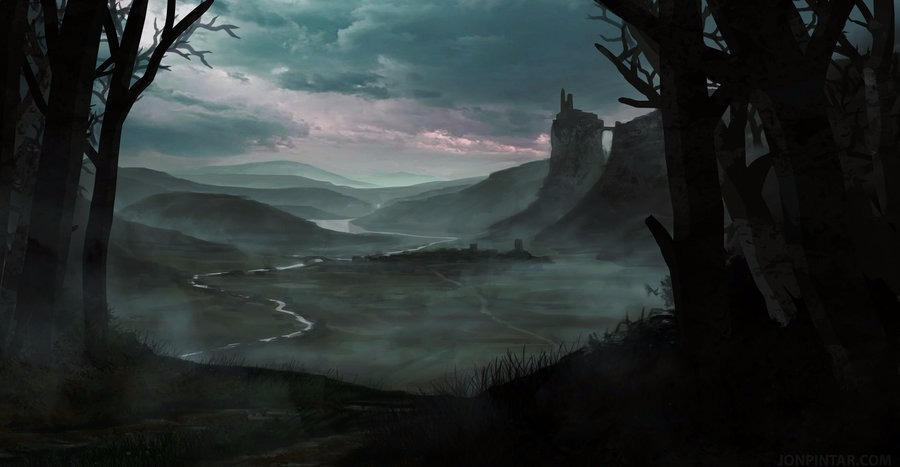
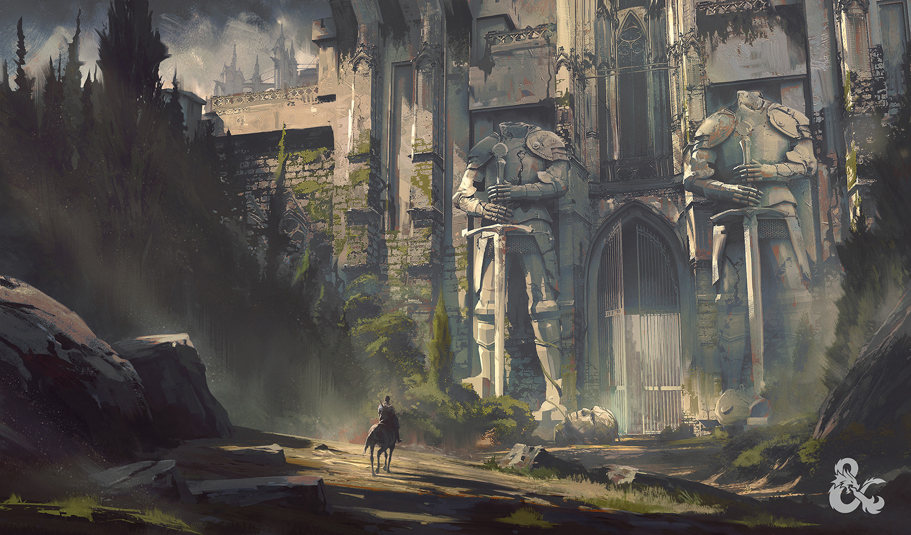

# Curse of Strahd
## _dnd 5e gothic survival horror campaign_

## Veikejai
- [Sailas ir jo seselis](chars/Sylas.md)
- [Volkeris](chars/Walker.md)
- [Veslis](chars/Weslie.md)

## Sesijos

- [Sesija #1 - 2022/10/04](sesija1.md)
- [Sesija #2](sesija2.md)
- [Sesija #3](sesija3.md)
- [Sesija #4](sesija4.md)

Zaidimas prasides su 2lvl veikejais, kurie gan greitai bus pakelti iki 5lvl. Turekite ankstyva veikejo vystymosi plana. Istorija pasibaigs veikejams bunant kazkur 10-15lvl tarpe, priklausomai nuo pasiekimu ir pasirinkimu. Lvlupai vyks "milestone" principu, pvz ivykdzius questa (ejimas i miska pasilvlupinti nepraeis). I pirma sesija ateikite su veikeju idejomis arba galite susiderinti is anksto kas uz ka zais.

## Veikeju susikurimo gaires

- Alignment - jokiu "Evil" veikeju, geriau butu "Good", galima "Neutral" 
- Starting equipment - pradesite tik su 1 item'u (perspejimas, kad nebutu soko)
- Stats - issirinkite viena bendra visai grupei - Line, Point Buy arba 4d6 roll (kiekvienas meta po 2x4d6, atmesdamas maziausia, visi veikejai naudoja tuos pacius ismestus skaicius)
- Class/Race/Lineage/Background - galima naudoti bet ka is oficialiu wotc knygu (no homebrew or kobold press)
- Rekomenduojama isbandyti Van Richten's Guide to Ravenloft opcijas:
    - Lineages - Hexblood, Reborn, Dhampir
    - Backgrounds - Haunted One, Investigator
- Flaws - naudosim background'u flaws, galima mesti, pasirinkti arba sugalvoti paciam (Personality Trait, Ideal, Bond, Flaw). Zaidimo metu jie gali kisti arba atsirasti papildomu

## Taisykles (optional, variant, house rules)
Papildomu taisykliu sarasas - https://5e.tools/variantrules.html  
Jeigu kazkas neparasyta, galite siulyti ar klausti pasitikslinimui, nes dalis papildomu taisykliu buvo paminetos pries tai (pvz milestones) ar kas susije su veikeju kurimu
### House rules
* Custom Inspirations (DM awarded)
* Alterations to magic (wish, teleport, plane shift etc) - setting specific restrictions apply

### Nenaudojamos taisykles
- Optional rule: Flanking - https://5e.tools/variantrules.html#flanking_dmg

### Siulomos taisykles
| Taisykle | Nuoroda | Kas/Kodel |
| -------- | ------- | ------- |
|Automatic Success|https://5e.tools/variantrules.html#automatic%20success_dmg|Maziau rollu|
|Initiative Variants|https://5e.tools/variantrules.html#initiative%20variants_dmg|Gal noretum naudoti initiative score (10+dex static), maziau rollu|
|Identification|https://5e.tools/variantrules.html#more%20difficult%20identification_dmg|Pasiulymas - Magic item'us galima atskirti ir be Detect Magic, bet kad suprasti jo savybes: Identify spell'as is karto viska pasako, per short rest'a 1pc 1itema issiaiskina, long rest - ??|
|Sleep|-|Labiau priminimas - pagal taisykles reikia 6val miego + 2val skirtos pasiruosti spellams ir tt, nors subalansuota 4pc, bet jus 3pc galesite per ta pati laika ir issimiegoti ir pabudeti ir pasiruosti spellus|
|Spellcasting|https://5e.tools/variantrules.html#spellcasting_xge|Ar norite zinoti is karto ka buria, ar darom su metimais, kad suprasti ar jeigu tas spell'as priklauso tavo klasei ir tu galetum ji burti - nebereikia testo?|
|Critical Success/Failure|-|1 - autofail; 20 - autosuccess (proto ribose); Atakuojant - galima pasirinkti 2xdice arba maksimum zalos be metimo|

### Naudojamos taisykles
| Taisykle | Nuoroda | Kas/Kodel |
| -------- | ------- | ------- |
|Diagonals|https://5e.tools/variantrules.html#diagonals_dmg|Pirmas istrizas ejimas 5ft, sekantis 10ft |
|Falling|https://5e.tools/variantrules.html#falling_xge|Aukstesniuose lvl turesit skraidymus, butu laiko sureaguoti krentant|
|Feats|https://5e.tools/variantrules.html#feats_phb|Galima imti|
|Hitting Cover|https://5e.tools/variantrules.html#hitting%20cover_dmg|Pabandysim naudoti uzdanga, jeigu imanoma|
|Madness|https://5e.tools/variantrules.html#madness_dmg|Bus kas sukelia madness efektu, tiek pc tiek npc|
|Parleying with Monsters|https://5e.tools/variantrules.html#parleying%20with%20monsters_tce|Naudosim skillus priesu lore/stats/strengths/weaknesses issiaiskinti (Monster Reseach lentele)|
|Skills with Different Abilities|https://5e.tools/variantrules.html#skills%20with%20different%20abilities_phb|Viskas aisku|
|Tool Proficiencies|https://5e.tools/variantrules.html#tool%20proficiencies_xge|Daugiau opciju kaip panaudoti irankius|

## Story begins

